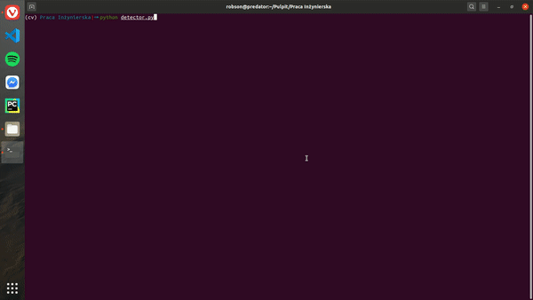

# Face-mask-detection

Face mask detection program made in python with Keras. Model was trained with 3 diffrent datasets: with_mask, without_mask and with_improperly_wear_mask. All this types can be recognized by software. Faces are detected on stream by Haar cascade and then pretrained model is applied. If recognized person don't wear face mask program is making a screen cast with face of that person. Image is saved in special directory and raported on mail via given gmail accout.

## Technologies
* Python
* Keras
* OpenCV
* Face recognition
* Google Colaboratory (recommended)

## Soft in action

